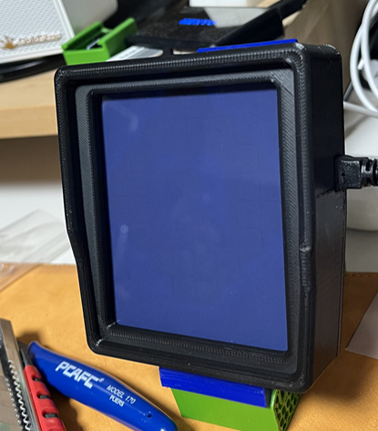
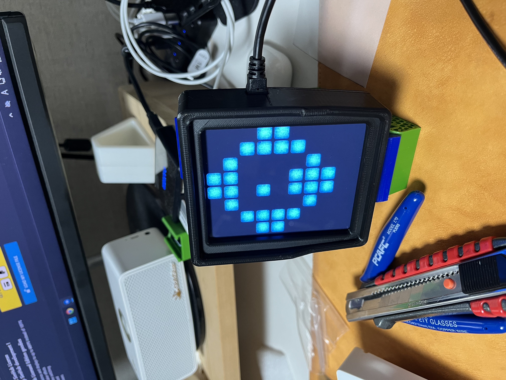
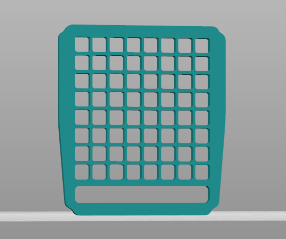
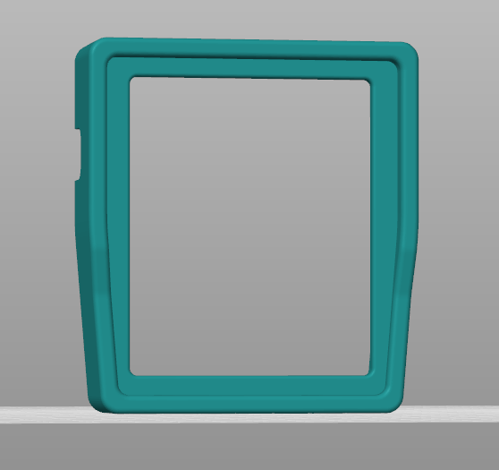
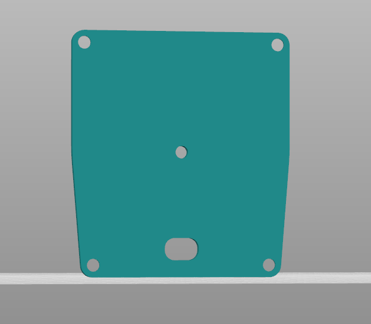
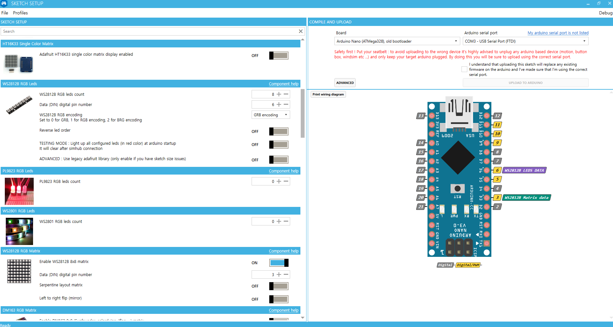

# CW-SC-Flag

SC-Flag is a SimHub-compatible racing flag display designed and developed by **Lee Chiwon** and **Park Sechan**.

This project was created to provide a reliable and responsive hardware flag system for sim racing enthusiasts.

## Credits

- **Design:** Lee Chiwon & Park Sechan
- **Development:** Lee Chiwon & Park Sechan

 

## 🎥 Video

---

# Hardware Wire

| Function    | Arduino | 8X8 LED Matrix | 8 LED Bar |
| ----------- | ------- | ------- | --------- |
| 5V                 | 5V       | 5V       | 5V          |
| GND                | GND      | GND      | GND         |
| 8X8 LED Matrix     | D3       | IN       |             |
| 8 LED Bar          | D6       |          | IN          |
 
---

# Part List 

|   Name              | EA | Site | Note | 
| ------------------- | ------ | --- | ------ |
| Arduino Nano   | 1 |  [Buy](https://smartstore.naver.com/misoparts/products/5779944205)| 
| 8X8 LED Matrix    | 1 |  [Buy](https://smartstore.naver.com/misoparts/products/13199208576)| 
| 8 LED Bar    | 1 |  [Buy](https://smartstore.naver.com/misoparts/products/9434328063)| 

# 3D Print

| Name |  EA  | Note |
| --- |  ------ |------ |
| 

  |  1EA  | 
| 

  |  1EA  | 
| 

  |  1EA  | 

# Simhub Arduino Setting

 * 8 LED Bar *
1. WS2812B RGB leds Count  = 8
2. Data(DIN digital pin number = 6
3. encoding = RGB encoding

 * RGB Matrix *
1. Enable WS2812B 8x8 matrix = ON
2. Data(DIN digital pin number = 3

