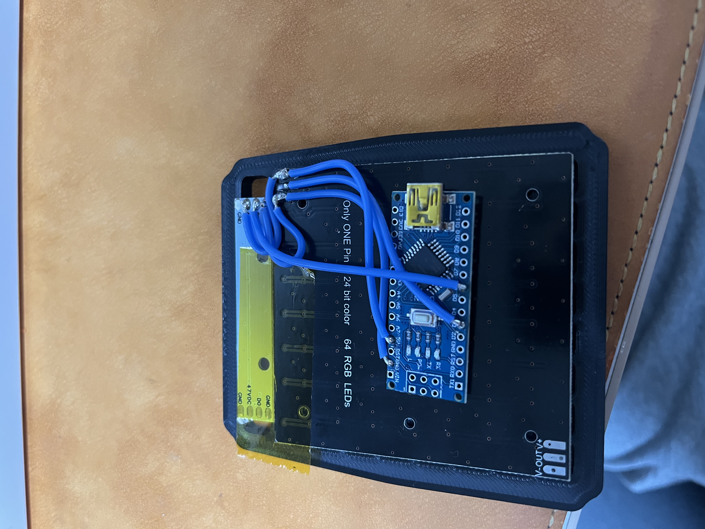

# CW-SC-Flag

SC-Flag is a SimHub-compatible racing flag display designed and developed by **Lee Chiwon** and **Park Sechan**.

This project was created to provide a reliable and responsive hardware flag system for sim racing enthusiasts.

## Credits

- **Design:** Lee Chiwon & Park Sechan
- **Development:** Lee Chiwon & Park Sechan

 

---

# Hardware

## Main Components

| Function    | Arduino | Motor 2 | Servo I/O |
| ----------- | ------- | ------- | --------- |
| 5V                 | 5V       | 10      | 4         |
| GND                | GND      | 8       | 6         |
| 8X8 LED Matrix     | D3       | 3       | -         |
| 8 LED Bar          | D6        |         | 3,5       |

---

